<br>

<div align="center">

| Round | Algo XIRECS | Manual XIRECS | Cumulative | Overall Rank |
|:-----:|:-----------:|:-------------:|:----------:|:------------:|
| 1 | 96,624 | 87,995 | 184,619 | 935 |
| 2 | 91,356 | 24,233 | 115,589 | 3000 |
| 3 | 226,474 | 74,473 | 300,947 | 48 |
| 4 | 186,940 | 23,566 | 210,506 | 39 |
| 5 | 388,174 | 93,786 | 481,960 | 19 |
| **Final** | 801,588 | 191,825 | **993,413** | **19** |

</div>

> ⭐ the repo, so you remember to check this out again for IMC Prosperity 5

## Team

<div align="center">

<table>
  <tbody>
    <tr>
      <td align="center" valign="top" width="200px">
        <a href="https://www.linkedin.com/in/himanshchitkara/">
          
          <br/><br/>
          <b>Himansh Chitkara</b>
        </a><br/>
        <a href="https://github.com/heyman7913">@heyman7913</a>
      </td>
      <td align="center" valign="top" width="200px">
        <a href="https://www.linkedin.com/in/jeetdekivadia/">
          
          <br/><br/>
          <b>Jeet Dekivadia</b>
        </a><br/>
        <a href="https://github.com/jeet-dekivadia">@jeet-dekivadia</a>
      </td>
      <td align="center" valign="top" width="200px">
        <a href="https://www.linkedin.com/in/ujaan-rakshit/">
          
          <br/><br/>
          <b>Ujaan Rakshit</b>
        </a><br/>
        <a href="https://github.com/UjaanRakshit">@UjaanRakshit</a>
      </td>
    </tr>
  </tbody>
</table>

</div>

IMC Prosperity is a two-week algorithmic trading competition run by IMC. We're JaneRT from Georgia Tech and this is our full writeup for Prosperity 4, where we finished 19th globally (7th in USA) out of 18,000+ teams. The final ranking was determined for Rounds 3, 4, and 5 in Prosperity 4.

Every round is covered: what the products were, how we figured out what was driving them, what we built, and what we'd change. The notebooks and code are all here if you want to dig in.


## Table of Contents

- [Tools](#tools)
- [Algorithmic Trading](#algorithmic-trading)
  - [Round 1: Market Making and Drift](#round-1-market-making-and-drift)
  - [Round 2: Refined Signal Stack](#round-2-refined-signal-stack)
  - [Round 3: Options Trading](#round-3-options-trading)
  - [Round 4: Regime Detection and Bot Signals](#round-4-regime-detection-and-bot-signals)
  - [Round 5: 50-Product Universe](#round-5-50-product-universe)
- [Manual Trading](#manual-trading)
  - [Round 1: The Auction Was the Real Puzzle](#round-1-the-auction-was-the-real-puzzle)
  - [Round 2: The Math Was Easy, The Crowd Was Not](#round-2-the-math-was-easy-the-crowd-was-not)
  - [Round 3: The Pretty Answer Was Not the Submission Answer](#round-3-the-pretty-answer-was-not-the-submission-answer)
  - [Round 4: Price the Product, Then Trade Only the Edge](#round-4-price-the-product-then-trade-only-the-edge)
  - [Round 5: Read the News, Then Size Like an Adult](#round-5-read-the-news-then-size-like-an-adult)
- [Resources](#resources)
- [Final Thoughts](#final-thoughts)


## Tools

<details>
<summary><b>Backtester and Visualizer</b></summary>

<br>

### Backtester

We used [GeyzsoN's Rust backtester](https://github.com/GeyzsoN/prosperity_rust_backtester), built specifically for Prosperity 4. Once strategies got complex (multi-product state tracking, options pricing), the standard Python backtester was too slow to iterate on. In Round 5 with 50 products, we ran 20 backtests in the time the Python version completed 2.

```bash
git clone https://github.com/GeyzsoN/prosperity_rust_backtester.git
cd prosperity_rust_backtester
cp /path/to/your_trader.py traders/latest_trader.py
rust_backtester --products full
```

One caveat: the official Prosperity backtester uses a different random seed from local tools, so a strategy that looks clean locally can behave differently in production. We learned this in Round 2. Always do a final validation run on the official site before submitting.


### Visualizer

> **We built this ourselves during the competition. It's one of the most useful things in this repo and we'd strongly recommend using it.**

```bash
python visualizer/visualize.py
# Opens at http://127.0.0.1:8766
```

The visualizer turns raw `metrics.json` and `submission.log` files into a full browser workspace: PnL curves, per-product attribution, fill inspection, spread context, drawdown tracking, and side-by-side run comparison. We built it from scratch mid-competition after getting burned by misleading final PnL numbers, and used it every round after that.

Final PnL alone doesn't tell you whether you made money steadily or in one late spike. It doesn't tell you which product is dragging, whether your fills are clean, or whether a good-looking backtest was just lucky.

A concrete example from Round 3: a backtest came back with a strong number. The visualizer showed 80% of the PnL came in the last 500 ticks, we were underwater for the first 7,000 ticks, and fill edge on VELVETFRUIT was negative all morning. We'd been sitting in a bad position all day and got bailed out by a late reversal. We found the bug, fixed the z-score direction, and submitted a better strategy. Without it, that bad version ships.

Comparison mode was especially useful. When two candidate strategies had similar final scores, overlaying their PnL curves, drawdown profiles, and per-product contribution made the actual difference obvious in seconds. Stop evaluating backtests by their last number alone.

```bash
python visualizer/visualize.py                         # opens http://127.0.0.1:8766
python visualizer/visualize.py --no-browser            # headless
python visualizer/visualize.py --port 8777             # different port
python visualizer/visualize.py --runs-dir "./runs"     # custom run directory
```

</details>


## Algorithmic Trading

<a id="round-1-market-making-and-drift"></a>
<details>
<summary><b>Round 1: Market Making and Drift</b></summary>

<br>

> *Two products, two completely different price processes: one stationary, one trending. Figuring out which is which before writing any code.*

**Products:** `ASH_COATED_OSMIUM`, `INTARIAN_PEPPER_ROOT` | **Position limit:** 80 per product

**Code:** [round_1_trader.py](algorithmic/submissions/round_1_trader.py) | **Notebook:** [round_1.ipynb](algorithmic/notebooks/round_1.ipynb)

Round 1 gave us two products and enough time to understand what we were looking at before writing anything. The right first question isn't "what algorithm should I use?" It's "what is generating this price?" Once you answer that, the strategy follows.


### ASH_COATED_OSMIUM

ASH sits in a tight horizontal band around 10,000, never deviating more than ~15 ticks across 30,000 rows of historical data. An Augmented Dickey-Fuller test confirmed what the chart already showed: **the series is strongly stationary, p-value essentially zero**. The AR(1) coefficient is strongly negative, meaning any move away from 10,000 doesn't just tend to reverse, it almost certainly reverses within a tick or two. Half-life of a deviation is under a tick. There's nothing to predict here, only a spread to collect.

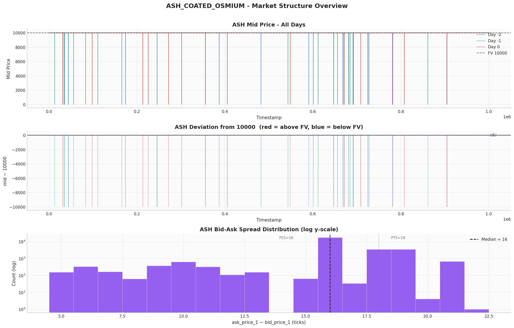

The strategy has three layers. First: large dislocations. When the deviation exceeds **6 ticks**, we take aggressively up to **25 units**, with higher size at larger dislocations (buckets at 6, 9, and 12 ticks). Second: when the wall midpoint disagrees with the best midpoint, signaling a genuine book imbalance. Third, accounting for **74% of ticks**: passive market making at stacked quotes.

We quoted in two layers passively because of the position limit. If all 80 units sit at the inner quotes, you fill quickly, hit the limit, and go idle for hundreds of ticks. Splitting across **inner (±5 ticks)** and **outer (±7 ticks)** keeps capacity available at both levels, and the inventory skew shifting both bid and ask toward fair value as position grows prevents runaway accumulation.

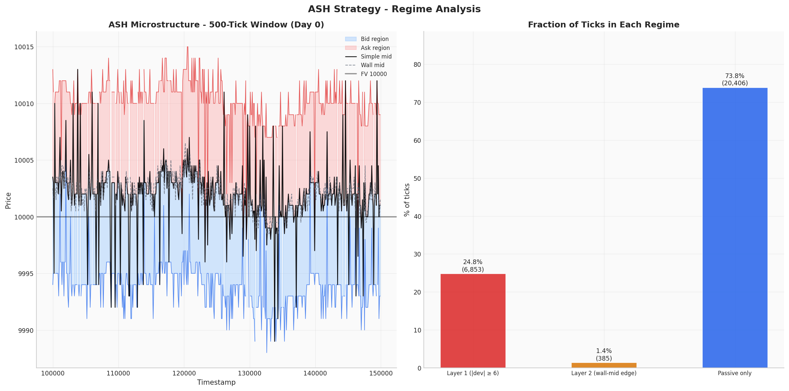

The biggest early mistake was not reserving enough capacity for aggressive takes. We were filling too eagerly on the passive layer and sitting idle when clear mispricings appeared. Reserving 25 units specifically for aggressive takes, regardless of passive fills, fixed it.

#### In hindsight

Avellaneda-Stoikov would have replaced the ad hoc inventory skew with a principled formulation. We also never analyzed the timing of taker activity. Bots crossing the spread clustered at certain times of day, and identifying that pattern would have let us size up during high-activity windows.


### INTARIAN_PEPPER_ROOT

PEPPER drifted linearly upward. We fit OLS on each training day separately and found **a slope of ~0.001 XIREC per timestamp, consistent across all three days**. Residual standard deviation was small enough that the cost of a bad entry was trivial compared to the value of holding 80 units across a full day's drift. Every tick you're not at maximum position is opportunity cost.

The strategy: buy 80 units at the open, hold all day, sell before the daily reset. We added a day-boundary anchor check so the model resets if PEPPER opens more than 50 XIRECs from the prior day's extrapolated trend, handling occasional gap opens.

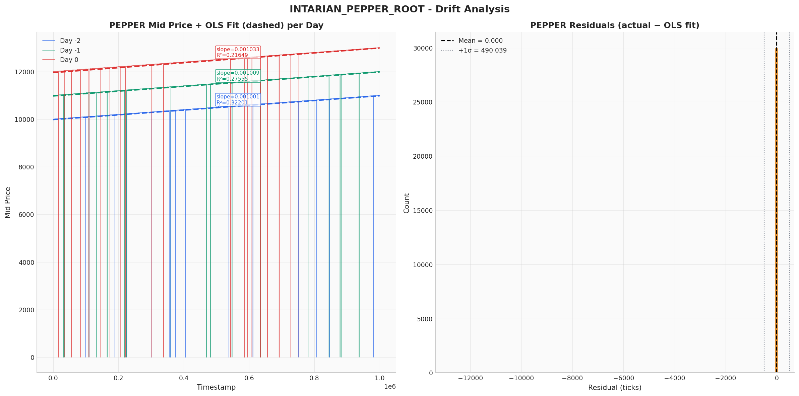

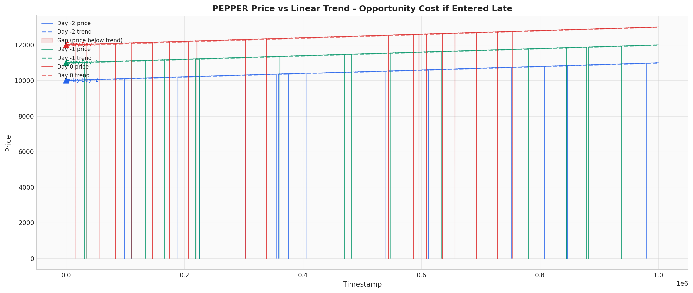

We also added a stop-loss at trend minus **25 ticks**. It never triggered. A stop-loss that never fires is the ideal outcome. Not having one because it's never fired yet is a completely different situation.

</details>


<a id="round-2-refined-signal-stack"></a>
<details>
<summary><b>Round 2: Refined Signal Stack</b></summary>

<br>

> *Same products as Round 1. The task was squeezing more signal out of what we already had, specifically by going deeper into order book microstructure.*

**Products:** `ASH_COATED_OSMIUM`, `INTARIAN_PEPPER_ROOT` (same products, no new additions)

**Code:** [round_2_trader.py](algorithmic/submissions/round_2_trader.py) | **Notebook:** [round_2.ipynb](algorithmic/notebooks/round_2.ipynb)

No new products. The task was to extract more signal from what we already had. There's almost always more information in the order book than a simple midpoint captures.


### ASH: Micro-Price and Signal Fair Value

Our Round 1 fair value estimate was `(best_bid + best_ask) / 2`. This ignores volume entirely. Consider a book where the bid has 1 unit and the ask has 50 units: simple mid is halfway between them, but there's 50x more selling pressure, and the price is far more likely to tick down than up.

Micro-price weights each side by the opposing volume:

```
micro = (bid_price × ask_volume + ask_price × bid_volume) / (ask_volume + bid_volume)
```

On a book with bid at 10,002, ask at 10,004, bid size 1, ask size 50: simple mid is 10,003, micro-price is 10,002.04. The book pressure is real information.

We blended micro-price with a slow EMA mean tracker and an order imbalance term:

```
signal_fair = 0.30 × micro_price
            + 0.70 × slow_EMA
            + 2.0  × imbalance
            - inventory_penalty × position
```

The EMA uses alpha = 0.0001, giving a half-life of roughly 6,900 ticks (~0.7 trading days). We wanted it nearly immovable. Its job is to represent the long-run level the market keeps returning to, and a single noisy tick shouldn't move it. The 70% anchor to this slow EMA prevents the signal from overreacting to individual microstructure moments.

Imbalance is `(bid_volume - ask_volume) / (bid_volume + ask_volume)`, ranging from -1 to +1. At +0.8 there's 9x more buying pressure than selling. We add 2.0 × imbalance to the fair value estimate, so a fully bid-heavy book shifts our estimate up by 2 ticks. We tested 3.0 first and it was too unstable on thin books where a single 1-lot swung imbalance from +0.9 to -0.9 between ticks.

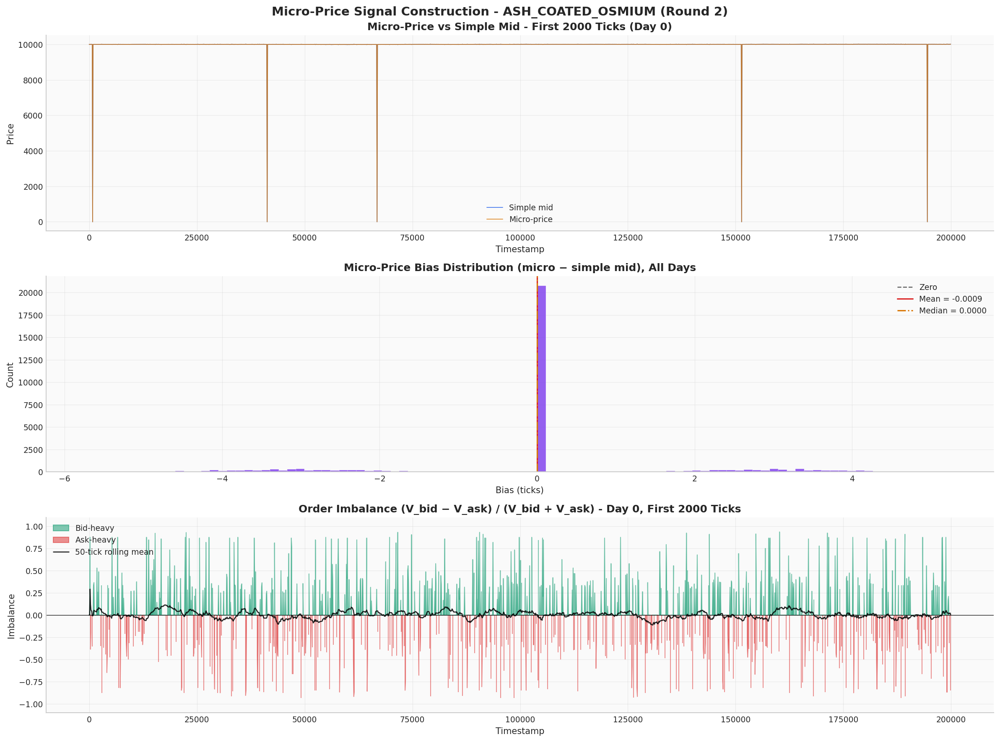

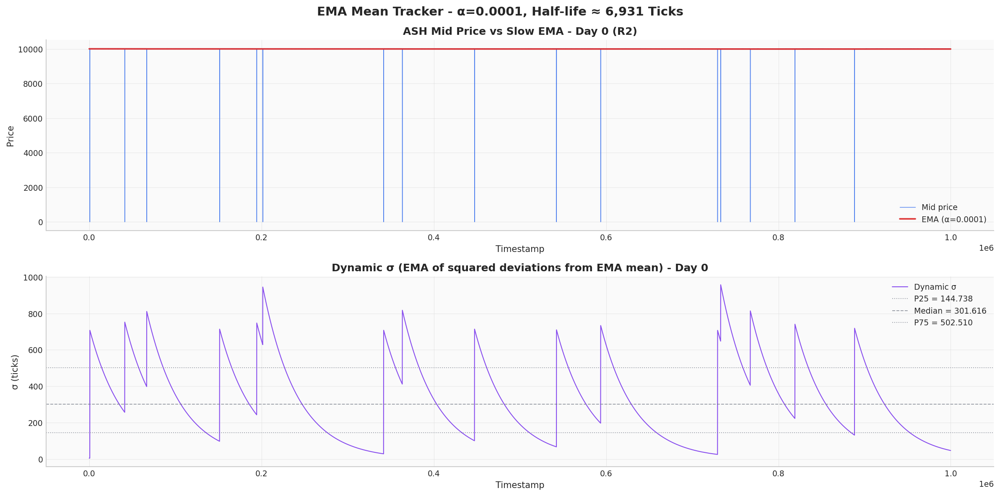

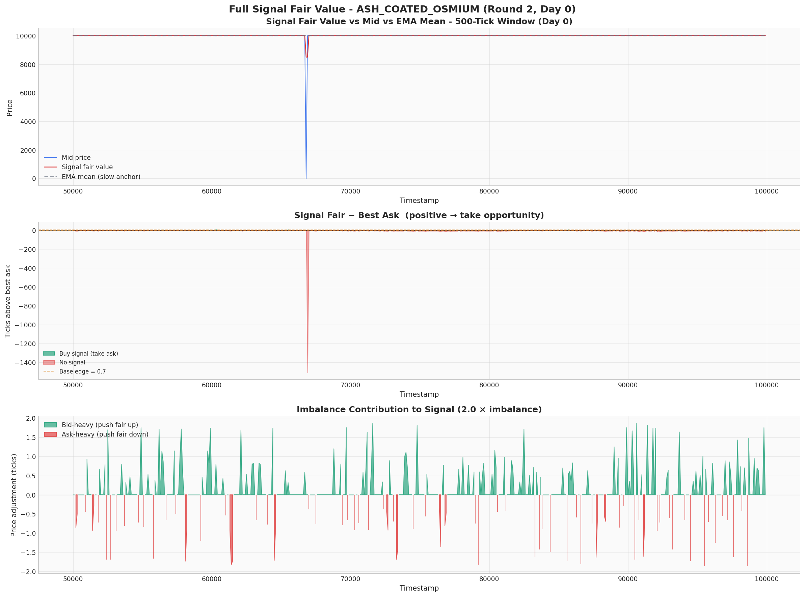

We ran a signal quality check: does `signal_fair - mid` predict next-tick returns? **Spearman rank correlation came back statistically significant (p essentially zero)**, and take opportunities triggered when the signal error exceeded the base edge had systematically higher next-tick returns than neutral ticks. The signal isn't large in magnitude, but it fires on **12.6% of ticks**, which adds up.

The dynamic take edge scales with realized volatility:
```python
edge = BASE_TAKE_EDGE × (ema_std / VOL_NORM)   # clamped [0.5, 2.5] ticks
```
During calm periods the edge tightens and we take more opportunities. During noisy periods we require more before crossing the spread.


### PEPPER: Risk Controls Added

Strategy unchanged: buy max, hold max. Two controls added:

- Stop-loss at 25 ticks adverse
- Re-anchor at 50 ticks divergence at day boundaries

Neither fired across the three training days. The re-anchor mechanism handled 94 quiet adjustments at boundary ticks, all within expected noise.

#### In hindsight

The imbalance coefficient of 2.0 was hand-tuned. A grid search would have been faster and likely found something slightly better. We also didn't run markout analysis on fills until late in Round 2. Checking whether buys actually happen near local lows should have been part of the workflow from Round 1.

</details>


<a id="round-3-options-trading"></a>
<details>
<summary><b>Round 3: Options Trading</b></summary>

<br>

> *First time options appeared in the competition: Black-Scholes pricing, IV scalping, and delta hedging a multi-strike portfolio in real time.*

**New products:** `VELVETFRUIT_EXTRACT`, `HYDROGEL_PACK`, call options `VEV_4000` through `VEV_5500`

**Position limits:** 200 per spot product, 300 per option, 1800 total shared delta

**Code:** [round_3_trader.py](algorithmic/submissions/round_3_trader.py) | **Notebook:** [round_3.ipynb](algorithmic/notebooks/round_3.ipynb)

Round 3 split the field. If you already knew how to price options, you could get straight to strategy. If not, the first night was an emergency crash course. None of us had implemented Black-Scholes before this round. If you're reading this before your competition, do the prep now.


### VELVETFRUIT_EXTRACT

VELVET floated around a soft anchor near 5,250, an Ornstein-Uhlenbeck process on a rubber band. Close to center, the band is slack. Far out, it pulls hard. We confirmed this with an AR(1) fit and a formal half-life estimate.

We traded z-score deviations from the anchor:

```
z = (price - 5250) / 12
```

```python
VELVET_LONG_Z  = -0.6   # buy dips aggressively
VELVET_SHORT_Z =  2.0   # wait for a larger move before shorting
```

The asymmetry matters. Dips snapped back faster and more reliably than rips. Upside moves in VELVET tended to extend before reverting, so we waited for a larger signal before shorting. Symmetric thresholds would have hurt one side significantly.

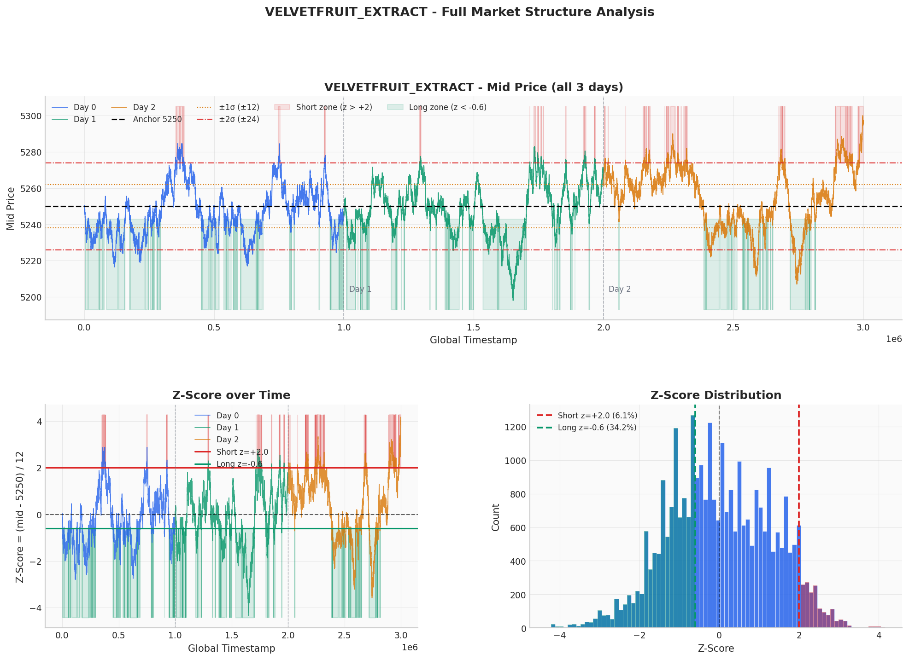

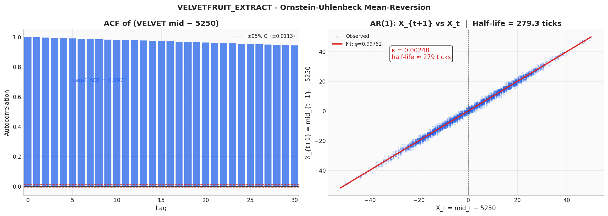


### HYDROGEL_PACK

Same framework, different calibration. HYDROGEL was less reliably mean-reverting, so we used wider thresholds and a different anchor:

```python
HYDROGEL_ANCHOR  = 9995
HYDROGEL_SIGMA   = 25
HYDROGEL_LONG_Z  = -1.8
HYDROGEL_SHORT_Z =  1.2
```

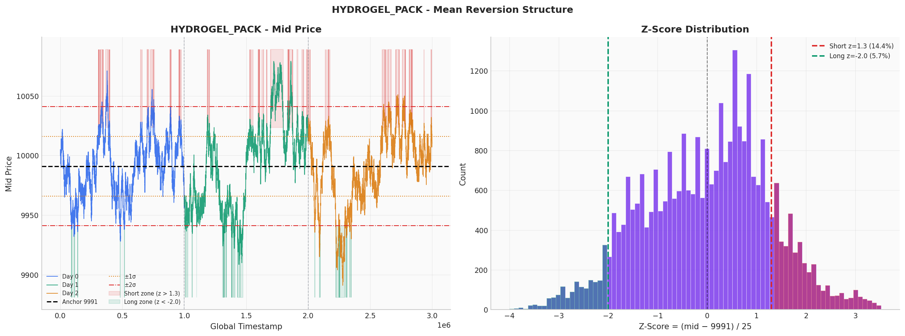


### VEV Options: Black-Scholes IV Scalping

`VEV_5000` gives the holder the right to buy VELVETFRUIT at 5,000 XIRECs at expiry. If VELVET ends at 5,300 the contract is worth 300 XIRECs. At 4,800 it's worthless.

Option value has two components: intrinsic value (`max(spot - strike, 0)`) and time value, the extra premium from remaining probability of moving into profit. Black-Scholes gives the combined fair price:

```
d1 = [ln(S/K) + 0.5σ²T] / (σ√T)
d2 = d1 - σ√T
Call = S·N(d1) - K·N(d2)
```

where σ = 0.20 (fitted from observed option prices), T = time to expiry in years, and N() is the standard normal CDF.

Each tick we compare market price to our Black-Scholes fair value. If the deviation exceeds `take_edge = 8`, we trade. The threshold was calibrated by looking at the historical distribution of deviations and finding the level that captured real mispricings rather than microstructure noise.

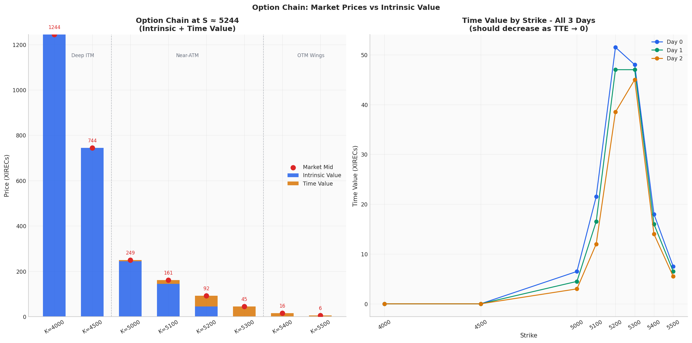

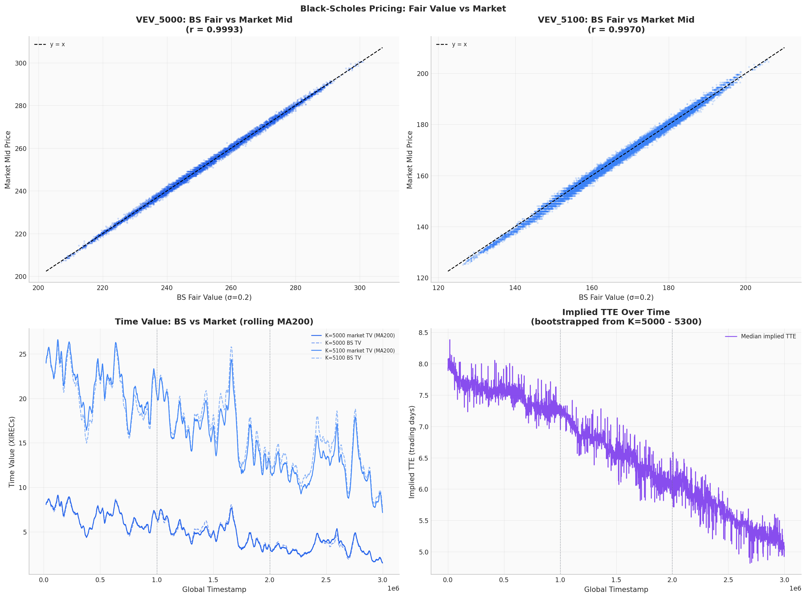

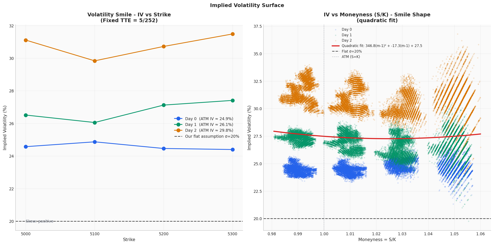

**Portfolio delta hedging:** Each option has a delta measuring its sensitivity to VELVET's price. A delta of 0.5 means a 1 XIREC VELVET move changes the option's value by 0.5 XIRECs. A portfolio with net delta +50 is making a directional bet on VELVET, which isn't what we want when our trade is about mispricing, not direction. We short the equivalent notional of VELVET spot to keep net delta near zero, within the shared delta limit of 1,800.

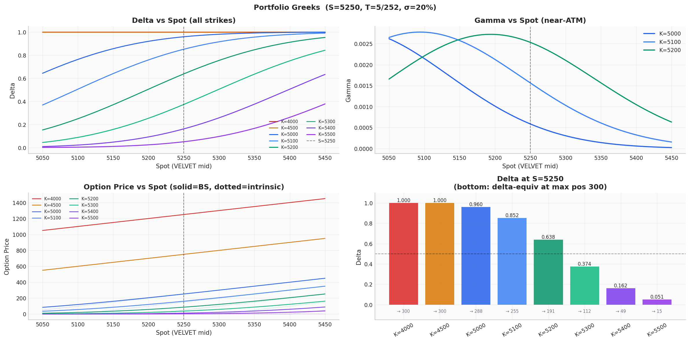

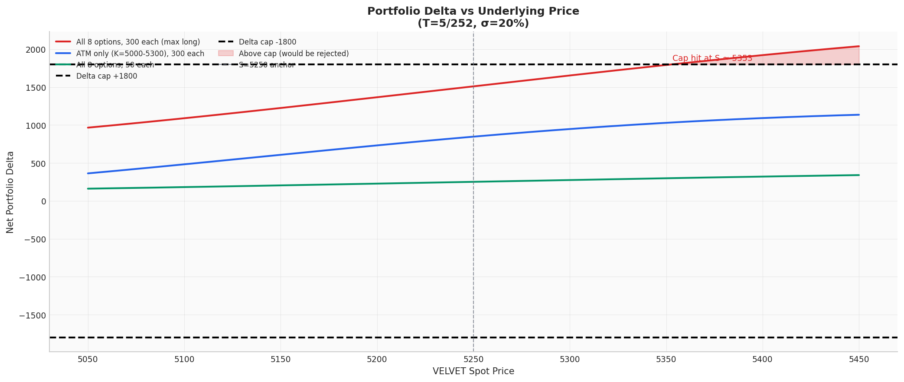

**Deep OTM bids:** For VEV_6000 to have intrinsic value, VELVET needs to hit 6,000, roughly a 14% move. Unlikely, but a 1 XIREC bid costs nothing. We bid 1 on VEV_6000 and VEV_6500 and forgot about them.

#### In hindsight

We used **flat volatility (σ = 0.20)** across all strikes and all time. A simple parabolic fit to the implied vol surface would have improved fair value estimates for far-strike options. We also rehedged delta every tick. Delta-band hedging would have been cleaner and reduced transaction cost. Gamma scalping (buying options and dynamically hedging to create a long-gamma position that profits from large moves in either direction) may have helped, but we didn't have enough time to try it out and analyze results before the submission.

</details>


<a id="round-4-regime-detection-and-bot-signals"></a>
<details>
<summary><b>Round 4: Regime Detection and Bot Signals</b></summary>

<br>

> *Same products as Round 3, but the real edge came from reading the opening price as a regime signal and reverse-engineering named participant behavior from trade flow.*

**Products:** Same as Round 3, with `VEV_5500`, `VEV_6000`, `VEV_6500` added to the options chain

**Code:** [round_4_trader.py](algorithmic/submissions/round_4_trader.py) | **Notebook:** [round_4.ipynb](algorithmic/notebooks/round_4.ipynb)

Round 4 was the most interesting to work through. Same products as Round 3, but digging into the data revealed signals we're fairly confident most teams missed, and neither came from price modeling.


### Regime Detection from the Opening Price

Our Round 3 VELVET strategy shorted at z = 2.0. That worked on normal days. But some days opened with VELVET already at z = 2.5 above anchor, elevated from the very first tick. We'd immediately short, the market would drift higher for another 2,000 ticks before reverting, and we'd take a large loss on a position that was ultimately correct but timed terribly.

Shorting at z = 2.5 is right eventually. But if it hits z = 4.0 before coming back, you've already taken a serious drawdown. The fix was to read the opening price and shift trading thresholds based on what regime the day appeared to be in.

We identified three soft regime centers (5245, 5267.5, 5295.5) corresponding to the three historical day opens. Rather than hard-assigning a regime, we used a Gaussian mixture: each day's open gets a weighted blend across all three centers, so an open halfway between two results in a 50/50 blend of their respective thresholds. No hard jumps at arbitrary boundaries.

In a low-open regime (Day 1: open = 5245), the short threshold tightened from 2.0 to 1.37. Spikes above 5250 are more transient on low-open days, so earlier entry was correct. In the high-open regime (Day 3: open = 5295.5), we widened the short threshold back toward 2.0 and compressed the long entry.

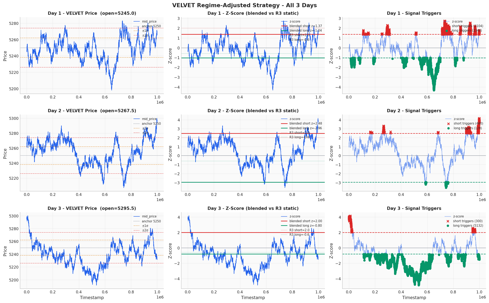

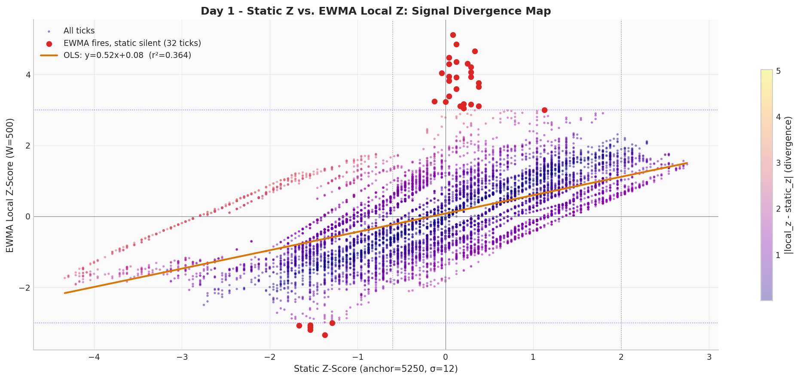

On Day 1, the blended short threshold triggered 2.5x more short entries than the Round 3 static threshold would have. Those additional entries captured reversion the static approach was leaving on the table.


### Named Participant Signals

Some bots in Prosperity have identifiable behavioral fingerprints. You don't need trader IDs, just consistent patterns in trade size, timing, direction, and which products get traded together. Once you see the same buyer appear 165 times on the same side of the same product within identifiable windows, you stop treating them as random liquidity.

We tracked six recurring participants across the historical trade data, and Round 4 gave us their official names: Mark01, Mark14, Mark22, Mark38, Mark55, and Mark67. Our behavioral matches lined up with those official labels.

Mark67 was the clearest signal. He rarely sold VELVET. A purely directional buyer appearing **963 times** across three days isn't a market maker, he has a view. We ran an event study: what does VELVET do in the 50 ticks after each Mark67 buy? Mean forward return was positive, **58.8% of events were positive at tick 50**, and the signal persisted for roughly **3,000 ticks** before fading. When Mark67 was active, we widened our short threshold by 1.0σ and increased passive bid size.

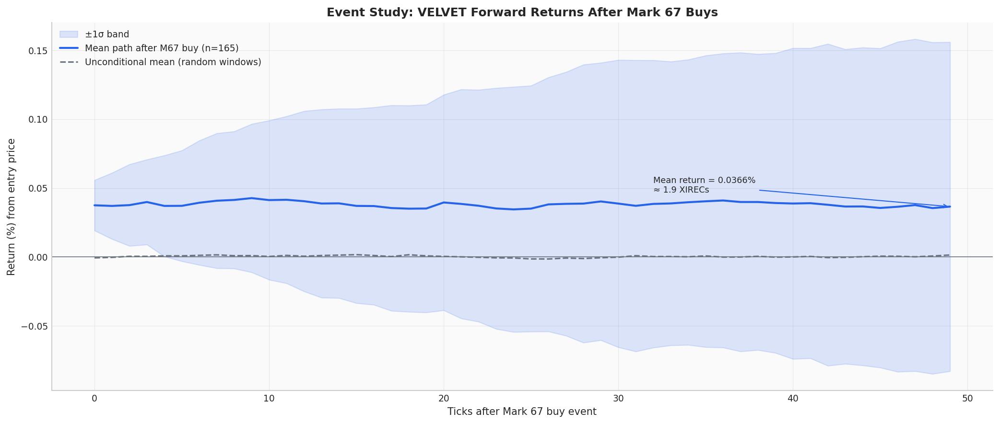

Mark01 and Mark22 were the second signal. Mark01 systematically bought option contracts from Mark22 across multiple strikes in quick succession within 200-timestamp windows. Buying VEV_5300 through VEV_6500 simultaneously from the same counterparty isn't a hedged position, it's a coordinated upside bet on VELVET. When we detected this basket pattern, we placed catch bids on the same near-ATM strikes.

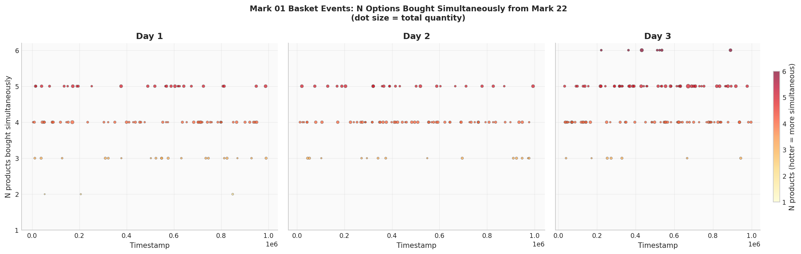

Each signal gets a TTL (time-to-live) so its effect persists after the last observed trade:

| Participant | TTL | Behavior | Response |
|-------------|-----|----------|----------|
| Mark55 | 3,000 | Informed flow on VELVET | Upsize passive market making |
| Mark01 + Mark22 | 6,000 | Multi-strike basket trades | Bias delta, place catch bids |
| Mark67 | 3,000 | Buy pressure on VELVET | Widen short threshold by +1σ |
| Mark14, Mark38 | 3,000 | HYDROGEL flow | Quote size adjustment only |

The 6,000-tick TTL for basket trades reflects that large basket-level orders unfold over multiple hours and the price impact doesn't materialize instantly.


### EWMA Reversion Overlay and Mid-Dip State Machine

On top of the slow z-score, we added a fast EWMA tracker with a 500-tick window. This catches intraday overbought/oversold conditions relative to recent price, not just the static anchor. If VELVET has been drifting up for 300 ticks and is now 3 local-σ above its EWMA, it's likely to snap back even if the global z-score hasn't crossed the entry threshold. Day 3's gradual decline from 5295 to 5232 was the clearest example. The global z-score didn't fully capture the entry timing until well into the sell-off, but the EWMA local-z fired earlier.

The mid-dip state machine handled sudden large drops: VELVET falling more than a threshold within N ticks triggers `DIP_DETECTED`, we buy aggressively, and unwind when the rebound target is hit. Four states: `NEUTRAL -> DIP_DETECTED -> ENTERED -> UNWIND`, resetting each day.

#### In hindsight

The three regime centers were hard-coded to exactly match the three observed historical opens, perfect in-sample and fragile out-of-sample. Fitting a GMM to a larger set of observed opens and letting the cluster centers emerge would have been more robust. We also burned time on a spot stabilizer that tried to back-infer the consensus VELVET level from ITM option prices. In theory it reduces exposure to momentary bid-ask noise. In practice, ITM options traded infrequently enough that the back-inferred spot was usually stale, and the net adjustment averaged **under 0.5 XIRECs**.

</details>


<a id="round-5-50-product-universe"></a>
<details>
<summary><b>Round 5: 50-Product Universe</b></summary>

<br>

> *The product list jumped to 50 overnight: structural basket arbitrage, cross-sectional OLS across all categories, and one product that trends when everything else reverts.*

**Products:** 50 products across 10 categories × 5 variants each | **Position limit:** 10 per product

**Code:** [round_5_trader.py](algorithmic/submissions/round_5_trader.py) | **Notebook:** [round_5.ipynb](algorithmic/notebooks/round_5.ipynb)

Opening the Round 5 product list and seeing 50 new names did make us nervous for a bit. But once we started plotting, the structure was obvious: most products within a category moved together. `SLEEP_POD_COTTON` and `SLEEP_POD_NYLON` are driven by the same underlying factor with independent noise per variant. That structure is tradeable.


### Product Universe

<table>
<tr><td valign="top">

| Category | Products |
|----------|---------|
| `GALAXY_SOUNDS` | BLACK_HOLES, DARK_MATTER, PLANETARY_RINGS, SOLAR_FLAMES, SOLAR_WINDS |
| `MICROCHIP` | CIRCLE, OVAL, RECTANGLE, SQUARE, TRIANGLE |
| `OXYGEN_SHAKE` | CHOCOLATE, EVENING_BREATH, GARLIC, MINT, MORNING_BREATH |
| `PANEL` | 1X2, 1X4, 2X2, 2X4, 4X4 |
| `ROBOT` | DISHES, IRONING, LAUNDRY, MOPPING, VACUUMING |

</td><td valign="top">

| Category | Products |
|----------|---------|
| `PEBBLES` | S, M, L, XL, XS |
| `SLEEP_POD` | COTTON, LAMB_WOOL, NYLON, POLYESTER, SUEDE |
| `SNACKPACK` | CHOCOLATE, PISTACHIO, RASPBERRY, STRAWBERRY, VANILLA |
| `TRANSLATOR` | ASTRO_BLACK, ECLIPSE_CHARCOAL, GRAPHITE_MIST, SPACE_GRAY, VOID_BLUE |
| `UV_VISOR` | AMBER, MAGENTA, ORANGE, RED, YELLOW |

</td></tr>
</table>

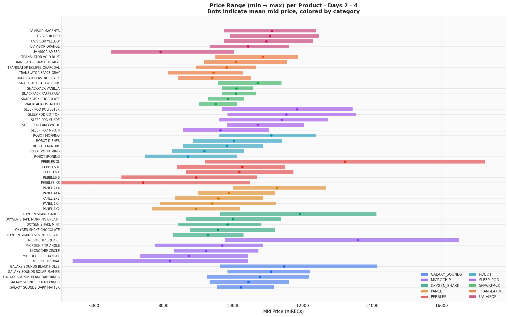


### PEBBLES: Structural Arbitrage

PEBBLES was the cleanest edge in the competition. The five sizes satisfy a near-exact linear constraint:

```
XL + L + M + S + XS ≈ 50,000
```

This isn't a statistical regularity, it's encoded in the product definition. We fit OLS to recover fair value for each size from its four siblings. The model achieved **R² of essentially 1.000000** with coefficients within 10⁻⁵ of -1.0 on every feature. Residual standard deviation was about **2.8 XIRECs**, with extremes reaching **±18 XIRECs**. Every time PEBBLES_XL deviated more than 10 ticks from the basket-implied fair value, we traded the reversion. With position limit 10, maximum PnL per event is roughly 80 XIRECs, but with 200 to 400 triggerable ticks per day across three days, it adds up fast.

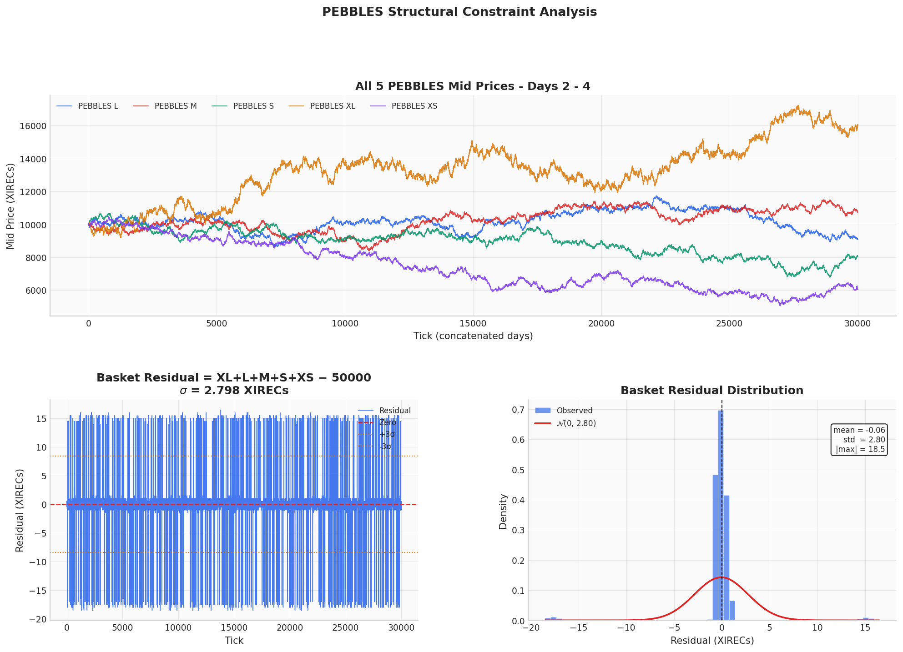

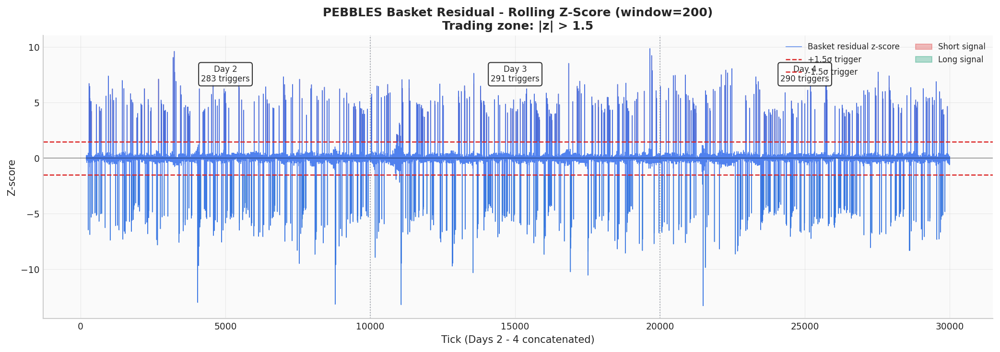


### Cross-Sectional OLS

For the remaining categories, we fit each product's fair price as a linear combination of its category peers:

```
fair_VANILLA ~ b0 + b1 × price(CHOCOLATE) + b2 × price(PISTACHIO) + b3 × price(RASPBERRY) + b4 × price(STRAWBERRY)
```

When market price deviates from the model prediction by more than the edge threshold, we trade. We chose OLS over more complex models because position limits are 10 per product. The upside from a more accurate model is capped and the overfitting risk is not. OLS is also interpretable: a coefficient of 0.95 means this product moves 0.95 for every 1.0 unit move in its peer, which can be sanity-checked.

For GALAXY_SOUNDS and TRANSLATOR products where intra-category correlation was only moderate (0.3 to 0.5 for some pairs), we extended the feature set to all 50 products. The full cross-section model achieved **R² of 0.97 versus 0.22** from the intra-category-only model. Dominant features were still the same-category peers, but SLEEP_POD and TRANSLATOR products also appeared, suggesting market-wide factors connecting seemingly unrelated categories.

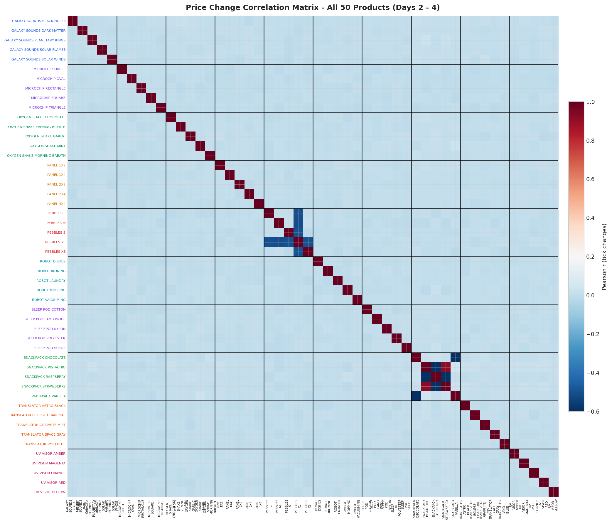

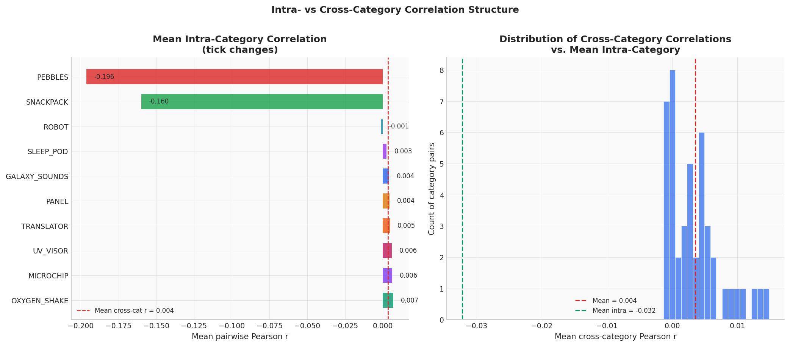

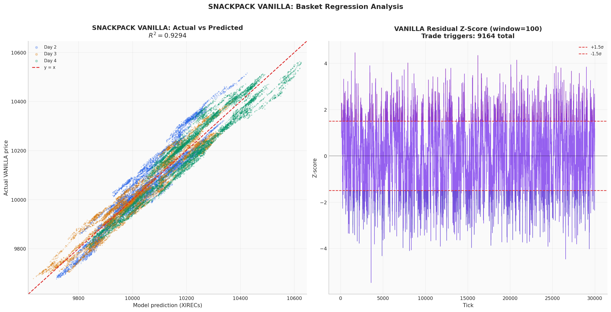

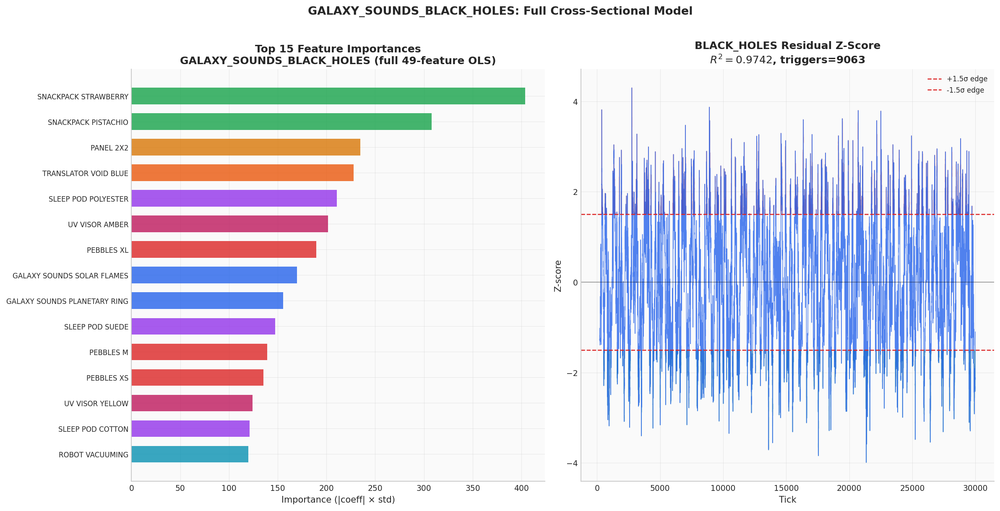


### Price-Shock Signals

Some products had sudden large moves that were reliably followed by either reversion or continuation. We classified each manually from the historical data:

```python
SHOCK_CONFIG = {
    "MICROCHIP_TRIANGLE":          ["revert",   50.0, 10, 0.0],
    "OXYGEN_SHAKE_CHOCOLATE":      ["revert",   50.0, 10, 0.0],
    "OXYGEN_SHAKE_MORNING_BREATH": ["momentum", 40.0, 10, 0.0],
    "PEBBLES_L":                   ["momentum", 50.0,  5, 0.0],
    "PEBBLES_XL":                  ["revert",  120.0, 10, 0.0],
    "ROBOT_DISHES":                ["revert",   30.0, 10, 0.0],
    "UV_VISOR_AMBER":              ["momentum", 40.0,  7, 0.0],
}
```

When price moves more than the trigger threshold from recent average, we adjust fair value toward the expected continuation or reversion. PEBBLES_XL has a trigger of 120, much higher than the 30-50 range for other products, because small XL moves are just noise. A large move signals a structural arb cascade through all five PEBBLES sizes.

MORNING_BREATH was the most interesting anomaly: the only one of 50 products that genuinely trended rather than reverting. Every other OXYGEN_SHAKE product fit the regression model cleanly. MORNING_BREATH had clear directional persistence, consistent with a bot running a strong directional program. Under mean-reversion it would have been a losing position all competition.

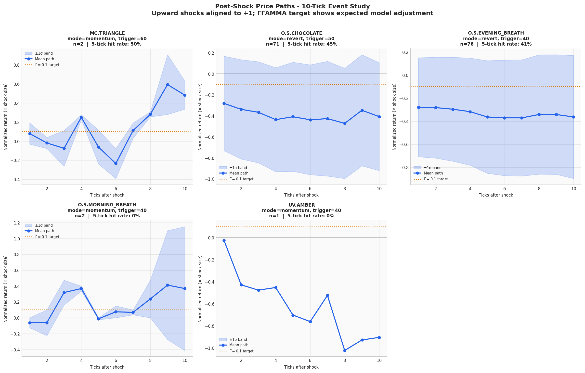

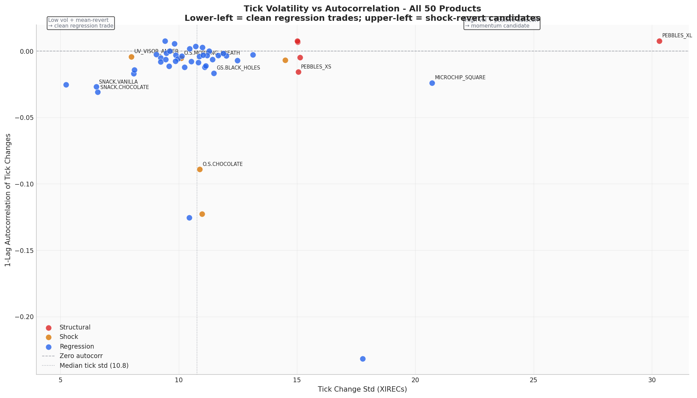


### GARLIC

```python
DRIFT_TARGETS = {"OXYGEN_SHAKE_GARLIC": 10}
```

GARLIC drifted steadily upward across competition days, the same structural drift as PEPPER in Round 1. We held 10 units the entire time. Sometimes the simplest position is the right one.

#### In hindsight

We assumed categories were independent, but the full cross-section data showed inter-category correlations we didn't act on in time. Shock thresholds were set by visual inspection. An event study measuring forward return distributions would have been more principled. We used a single **GAMMA of 0.40** for all shock products when per-product calibration would have helped. The biggest regret across the whole competition was the **absence of a parameter grid search harness**. Every threshold test was manual: change a number, run the backtester, write it down, repeat. A proper sweep would have saved hours per round, and possibly more optimal results.

</details>


## Manual Trading

<a id="round-1-the-auction-was-the-real-puzzle"></a>
<details>
<summary><b>Round 1: The Auction Was the Real Puzzle</b></summary>

<br>

> *A call auction where everything clears at a single price: the book was a red herring, and queue mechanics determined fills entirely.*

**Notebook:** [round_1_manual_auction.ipynb](manual/notebooks/round_1_manual_auction.ipynb) | **Writeup:** [round_1_auction.md](manual/writeups/round_1_auction.md)

Round 1 looked easy for about five minutes. The book showed offers below the Merchant Guild buyback price, so the first instinct was to sweep the cheap asks and lock in the spread. That wasn't the real problem. The real problem was the call auction rule.

Everything cleared at one price. The exchange picked the price with maximum traded volume, broke ties in favor of the higher price, then applied price-time priority. We also submitted last, so a cheap-looking order could still get zero fill if older bids were ahead of us at the clearing price.

We modeled the mechanism properly. For each candidate clearing price, total executable demand was the existing bid volume at prices at least that level plus our own order if our limit was at least that level. Total executable supply was the existing ask volume at prices at most that level. Traded volume was the minimum of the two. We brute-forced the integer space rather than stopping at obvious price levels, which revealed that the best order was never "buy all visible edge" but rather "enter the queue just before the regime changes against us."

```
DRYLAND_FLAX:   BUY 9,999 @ 30    clearing at 29,  expected PnL  9,999
EMBER_MUSHROOM: BUY 19,999 @ 17   clearing at 16,  expected PnL 77,996
```

In Flax, we accepted a slightly worse clearing price because it bought much more fill before the next regime jump. In Mushroom, we avoided the seductive oversized order that looked great on a screenshot of the book but performed much worse once queue priority and tie-breaking kicked in.

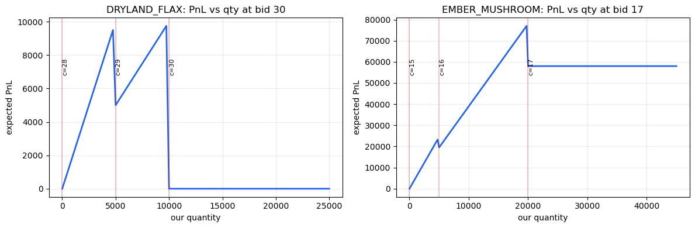

This round didn't reward intuition. It rewarded exact auction modeling. The teams ahead of us searched the same mechanism just as carefully and found the same quantity boundaries.

</details>


<a id="round-2-the-math-was-easy-the-crowd-was-not"></a>
<details>
<summary><b>Round 2: The Math Was Easy, The Crowd Was Not</b></summary>

<br>

> *Budget allocation across three variables: two deterministic, one ranked against the field. The clean mathematical answer was only right if you predicted where the crowd would go.*

**Notebook:** [round_2_invest_expand.ipynb](manual/notebooks/round_2_invest_expand.ipynb) | **Writeup:** [round_2_invest_expand.md](manual/writeups/round_2_invest_expand.md)

Round 2 asked us to split budget across Research, Scale, and Speed. Research and Scale were deterministic optimization variables with smooth formulas. Speed was ranked against the rest of the field and awarded a multiplier based on your position in the distribution. Two problems at once: solve the deterministic split, then guess where the crowd would cluster on Speed.

The pure math strongly preferred lower Speed because it preserved more budget for productive spend:

```
Speed 0  → Research 23, Scale 77, pre-speed gross 742,329.92
Speed 13 → Research 21, Scale 66, pre-speed gross 618,862.11
Speed 42 → Research 15, Scale 43, pre-speed gross 361,658.68
```

That was the trap. The key stress test from our notebook:

```
Speed 42 at top multiplier beats Speed 13 whenever multiplier_13 < 0.526
Speed 13 at m=0.5  →  259,431 XIRECs
Speed 42 at m=0.9  →  275,492 XIRECs
```

The low-Speed solution only wins if the crowd gives it enough rank protection. Once that protection disappears, the inferior deterministic answer becomes the better tournament answer.

**We submitted: Research 15%, Scale 43%, Speed 42%.**

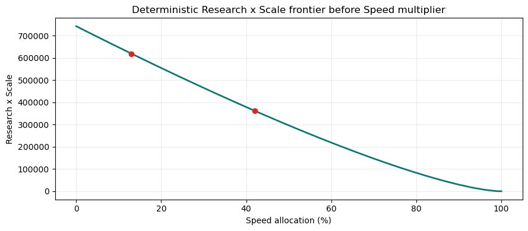

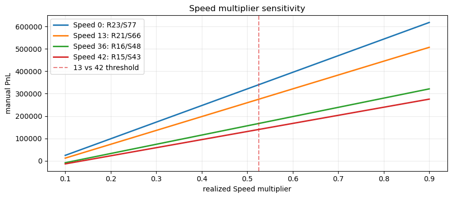

The lesson we carried forward: when a round has a crowd-dependent payoff, solve the crowd first and the clean math second. Ranked variables are not productive variables. We got to this view later than we should have. The low-Speed book was mathematically elegant and we spent too long admiring the deterministic frontier before asking where strong teams would actually anchor.

</details>


<a id="round-3-the-pretty-answer-was-not-the-submission-answer"></a>
<details>
<summary><b>Round 3: The Pretty Answer Was Not the Submission Answer</b></summary>

<br>

> *A two-bid Bio-Pod auction with a cubic penalty on the second bid if it lands below the field average. Optimal bidding required modeling the crowd, not just the EV.*

**Notebook:** [round_3_bio_pods.ipynb](manual/notebooks/round_3_bio_pods.ipynb) | **Writeup:** [round_3_bio_pods.md](manual/writeups/round_3_bio_pods.md)

Round 3 was a two-bid auction for Bio-Pods. Each counterparty had a reserve price drawn uniformly from the grid 670 to 920, and every pod bought would be sold the next day at 920. We submitted two bids. The second bid had a penalty: if our second bid was at or below the global average second bid, the payoff on that tranche was multiplied by `((920 - avg_b2) / (920 - b2))³`. EV problem with a crowd-sensitive landmine on the second bid.

The clean no-penalty optimum was **751 / 836** with expected value **84.33 per counterparty**. Also the fragile answer. If the field average second bid landed even modestly above 836, the second leg started getting penalized.

The notebook showed the best-response shelf as a function of expected field average:

```
avg 837..841 → 751 / 841
avg 842..846 → 756 / 846
avg 847..851 → 756 / 851
```

We chose **756 / 846**, sitting in the middle of the plausible regime. The cost of hedging was small:

```
751 / 836  →  expected 84.3333 per counterparty
756 / 846  →  expected 84.0000 per counterparty
```

Giving up 0.33 of expected value per counterparty to protect against a penalty cliff was a reasonable trade.

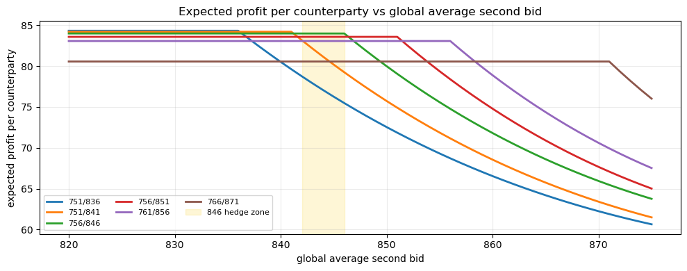

If we lost ground here, the mistake was a crowd prior, not math. If the field average second bid drifted above 846, stronger shading toward 766 / 871 would have beaten our hedge. The winner likely forecast a higher field average than we did, or was simply more willing to pay for protection.

</details>


<a id="round-4-price-the-product-then-trade-only-the-edge"></a>
<details>
<summary><b>Round 4: Price the Product, Then Trade Only the Edge</b></summary>

<br>

> *Static exotic options pricing. The edge came from correctly modeling discrete monitoring on the knock-out put, where most teams likely used the wrong barrier formula.*

**Notebook:** [round_4_exotic_options.ipynb](manual/notebooks/round_4_exotic_options.ipynb) | **Writeup:** [round_4_exotic_options.md](manual/writeups/round_4_exotic_options.md)

Round 4 was a static options pricing round with no crowd ranking, no intraday hedging decisions, and no reason to get clever. Value each listed product under the official model and compare fair value to the executable bid or ask.

Official parameters: S₀ = 50, volatility = 251%, risk-neutral drift = 0, 4 steps per trading day, 252 trading days per year, contract size = 3,000.

We split the products into natural buckets: vanilla calls and puts under Black-Scholes, binary put via risk-neutral terminal probability, the chooser via static decomposition, and the knock-out put via discrete-step Monte Carlo because monitoring was on the simulation grid, not continuous. Once we stopped forcing one model onto every product, the book became defensible.

The chooser felt like something people would want to own. Under the actual static decomposition, it was a sell. The knock-out was one of the cleaner edges precisely because many teams likely modeled it with a continuous-barrier shortcut, which is wrong when monitoring is discrete.

| Product | Direction | Fair Value | Market Price | Edge |
|---------|-----------|------------|-------------|------|
| AC_60_C | SELL 50 | 8.7918 | 8.80 bid | sell |
| AC_50_P_2 | BUY 50 | 9.8707 | 9.75 ask | buy |
| AC_50_C_2 | BUY 50 | 9.8707 | 9.75 ask | buy |
| AC_50_CO | SELL 50 | 21.8977 | 22.20 bid | sell |
| AC_40_BP | SELL 50 | 4.7679 | 5.00 bid | sell |
| AC_45_KO | BUY 500 | 0.2056 | 0.175 ask | buy |

**Total expected PnL: approximately 163,438 XIRECs.**

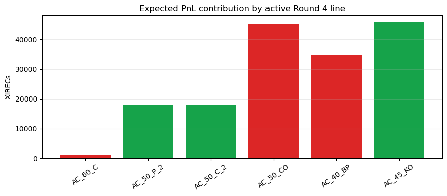

This round rewarded precision and the discipline to leave fair products alone. The teams ahead of us estimated the exotics more precisely, especially the knock-out, and held size discipline on only the cleanest edges.

</details>


<a id="round-5-read-the-news-then-size-like-an-adult"></a>
<details>
<summary><b>Round 5: Read the News, Then Size Like an Adult</b></summary>

<br>

> *News-driven portfolio construction with a quadratic fee structure. The challenge was forming move priors from articles and sizing positions before the fee curve worked against you.*

**Notebook:** [round_5_news_portfolio.ipynb](manual/notebooks/round_5_news_portfolio.ipynb) | **Writeup:** [round_5_news_portfolio.md](manual/writeups/round_5_news_portfolio.md)

Round 5 was built around news articles, but the sizing rule underneath was clean. For a product with expected one-day move `m` and allocation `p`, net PnL was approximately:

```
PnL = 1,000,000 × (m × p/100 - (p/100)²)
```

The unconstrained optimum for any single name is `p* = 50 × |m|`. So it was two separate problems: form a directional view and a move estimate from each article, then size while respecting the quadratic fee. The first part was judgment. The second was math.

We read each article in layers: direct fundamental effect, second-order narrative, how much might already be priced, and whether the crowd would overreact in the same direction. That gave us a ranked board of longs and shorts rather than a pile of headlines.

| Product | Direction | Allocation |
|---------|-----------|------------|
| Obsidian cutlery | SHORT | 5% |
| Pyroflex cells | SHORT | 9% |
| Thermalite core | LONG | 7% |
| Lava cake | SHORT | 22% |
| Magma ink | LONG | 5% |
| Scoria paste | LONG | 4% |
| Ashes of the Phoenix | SHORT | 12% |
| Volcanic incense | LONG | 5% |
| Sulfur reactor | LONG | 5% |

**Total capital deployed: 74%.**

```
Final book:   mean 93,314.9 XIRECs,  median 93,426.8 XIRECs
Rank1-shot:   mean 93,065.4 XIRECs,  median 93,157.3 XIRECs
```

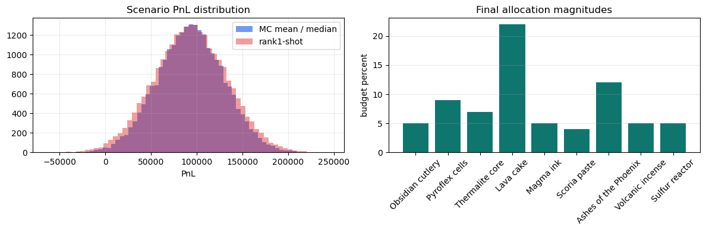

Lava cake was the largest position at 22% because the article warranted it. Most other names stayed moderate because fees matter and article interpretation is noisy. Leaving 26% undeployed wasn't a mistake. Once the quadratic fee curve turns against you, forcing capital in is worse than sitting on cash.

The first impulse was a hotter book, pressing Lava, Ashes, and Pyroflex harder. The notebook showed the fee curve starts punishing extra size before expected return justifies it on those names. Being confident in a direction isn't the same as having permission to oversize.

#### In hindsight

Our move priors were probably too measured on a few names where fundamental momentum and crowd behavior both leaned harder than we anticipated. The winner likely identified the few stories that would move both fundamentally and attract the field, then pressed those names aggressively while avoiding fee drag on weaker ideas.

</details>


## Resources

| Team | Year | Rank | Notes |
|------|------|------|-------|
| [Frankfurt Hedgehogs](https://github.com/TimoDiehm/imc-prosperity-3) | 2025 | 2nd globally | Detailed writeup covering IV scalping, stat-arb, and bot detection. |
| [CMU Physics (chrispyroberts)](https://github.com/chrispyroberts/imc-prosperity-3) | 2025 | 7th / 1st USA | Candid breakdown with useful video walkthrough on product structure. |
| [jmerle (solo)](https://github.com/jmerle/imc-prosperity-2) | 2024 | 9th | Best open-source visualizer for Prosperity 2. Excellent research tooling reference. |

These are some repositories we found helpful while doing Prosperity this year. Feel free to check them out!


## Final Thoughts
Looking back, the most useful habit we built was spending time on "what is actually going on here" before writing any code. That sounds obvious, but it's easy to skip under time pressure, and it cost us in the rounds where we skipped it. Round 2's manual challenge is the clearest example: we solved the math correctly and only realized late that the math was the wrong thing to optimize.

The other thing that kept paying off was building proper tooling. The visualizer took time to build mid-competition, but every hour we put into it came back multiplied across the rounds that followed. Trusting final PnL numbers without understanding where they came from would have cost us far more.

For anyone reading this before their own run: the strategies here are less important than the process behind them. Figure out what's generating the price before you think about what to trade. Model the mechanism before you optimize against it. And if something in this repo helped you out, please ⭐.


*JaneRT, 19th Global, IMC Prosperity 4, 2026*
